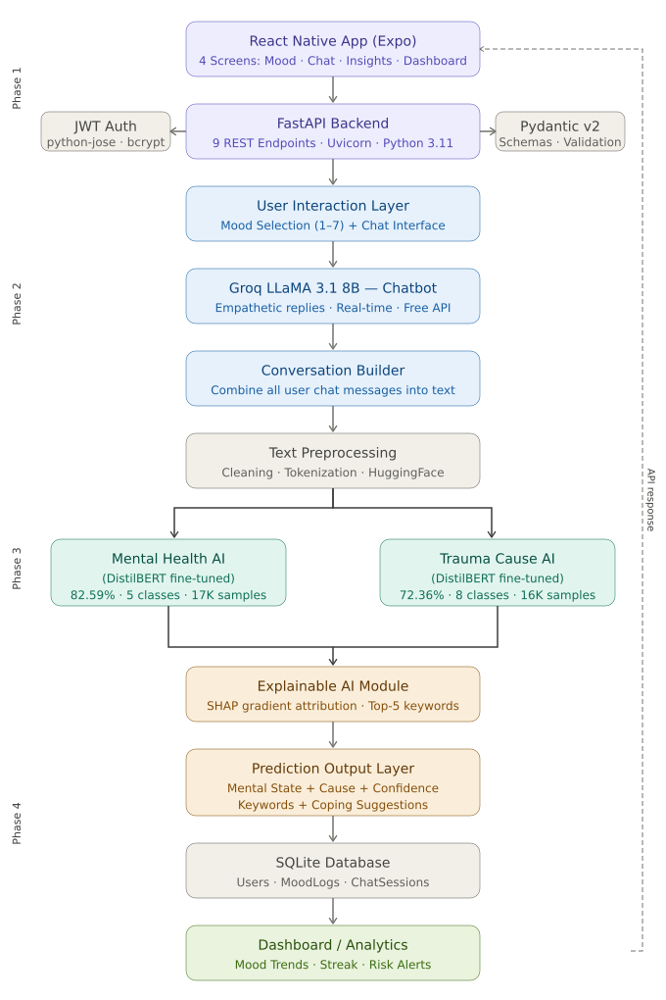

#  Explainable AI-Based Mental Health Detection System

> Transformer-Based Mental Health and Cause Detection with SHAP Explainability and Conversational AI

**Author:** Deepika Vishwakarma | Roll No: MSA24013  
**Supervisor:** Dr. Deepak Kumar Singh  
**Institute:** IIIT Lucknow | M.Sc. AI & ML | 2026

---

## 📌 Overview

This project is a production-ready, end-to-end Explainable AI system designed for integration with the MyUni React Native mobile application to detect university students’ mental health conditions and their root causes through natural conversation. The system combines fine-tuned DistilBERT models for mental state and cause classification, SHAP-based explainability for keyword-level interpretation, and a Groq-powered LLaMA 3.1 chatbot for empathetic real-time interaction.

---

##  Key Results

| Model | Task | Accuracy |
|-------|------|---------|
| DistilBERT (Model 1) | Mental State Classification | **82.59%** |
| DistilBERT (Model 2) | Cause Classification | **72.36%** |

---

##  Project Structure

```
mental_health_ai/               ← Backend (FastAPI)
├── app/
│   ├── main.py                 ← FastAPI entry point
│   ├── config.py               ← Environment settings
│   ├── database.py             ← SQLAlchemy async DB
│   ├── models/
│   │   ├── user.py             ← Users table
│   │   ├── mood_log.py         ← MoodLogs table
│   │   └── chat_session.py     ← ChatSessions table
│   ├── schemas/
│   │   ├── user.py             ← Auth schemas
│   │   └── mood_chat.py        ← Chat/Analysis schemas
│   ├── routers/
│   │   ├── auth.py             ← Register / Login / Me
│   │   ├── chat.py             ← Chat send / Session
│   │   ├── analyze.py          ← AI Analysis endpoint
│   │   └── mood_dashboard.py   ← Mood log / Dashboard
│   └── services/
│       ├── auth_service.py     ← JWT + BCrypt
│       ├── groq_service.py     ← LLaMA 3.1 Chatbot
│       └── ml_service.py       ← DistilBERT inference + SHAP
├── ml/
│   ├── dataset/
│   │   └── Combined Data.csv   ← Kaggle Reddit dataset
│   ├── preprocess.py           ← Data cleaning + split
│   ├── train.py                ← Mental state model training
│   ├── create_cause_dataset.py ← Cause dataset creation
│   ├── train_cause.py          ← Cause model training
│   └── inference.py            ← Model testing
├── .env                        ← Environment variables
├── requirements.txt            ← Python dependencies
└── README.md

MindCareApp/                    ← Frontend (React Native)
├── src/
│   ├── screens/
│   │   ├── MoodScreen.js       ← Mood Selection (7 moods)
│   │   ├── ChatScreen.js       ← AI Chat Interface
│   │   ├── InsightsScreen.js   ← Analysis Results
│   │   └── DashboardScreen.js  ← 7-Day Trends
│   ├── services/
│   │   └── api.js              ← Axios API calls
│   └── context/
│       └── AuthContext.js      ← JWT Auth state
└── App.js                      ← Navigation setup
```

---

## ⚙️ Tech Stack

| Layer | Technology |
|-------|-----------|
| AI Model | DistilBERT (HuggingFace Transformers) |
| Chatbot | Groq LLaMA 3.1 8B Instant |
| Explainability | SHAP gradient-based attribution |
| Backend | FastAPI + Uvicorn + Python 3.11 |
| Database | SQLite + SQLAlchemy (async) |
| Authentication | JWT (python-jose) + BCrypt |
| Frontend | React Native + Expo SDK 55 |
| API Client | Axios |

---

## 🚀 Quick Start

### Backend Setup

```bash
# 1. Clone and enter project
cd mental_health_ai

# 2. Create virtual environment
python -m venv venv
venv\Scripts\activate        # Windows
source venv/bin/activate     # Mac/Linux

# 3. Install dependencies
pip install -r requirements.txt

# 4. Setup environment variables
cp .env.example .env
# Fill in GROQ_API_KEY from https://console.groq.com

# 5. Run server
uvicorn app.main:app --reload --port 8000

# 6. Open Swagger UI
# http://localhost:8000/docs
```

### ML Model Training

```bash
# Step 1 — Preprocess dataset
python ml/preprocess.py

# Step 2 — Train mental state model (~30 min)
python ml/train.py

# Step 3 — Create cause dataset
python ml/create_cause_dataset.py

# Step 4 — Train cause model (~30 min)
python ml/train_cause.py

# Step 5 — Test models
python ml/inference.py
```

### Frontend Setup

```bash
cd MindCareApp

# Install dependencies
npm install expo
npm install react-dom react-native-web

# Run app
npx expo start --web

```

---

## 🔑 API Endpoints

| Method | Endpoint | Description | Auth |
|--------|---------|-------------|------|
| POST | `/api/auth/register` | Register new user | No |
| POST | `/api/auth/login` | Login → get JWT | No |
| GET | `/api/auth/me` | Current user info | Yes |
| POST | `/api/chat/send` | Send message to AI | Yes |
| GET | `/api/chat/session/{id}` | Get session messages | Yes |
| POST | `/api/analyze/session` | Analyze conversation | Yes |
| POST | `/api/mood/log` | Quick mood check-in | Yes |
| GET | `/api/mood/history` | 30-day mood history | Yes |
| GET | `/api/dashboard` | 7-day chart + streak | Yes |

---

##  AI Pipeline & System Architecture



The system follows a multi-phase architecture integrating:
- React Native mobile application
- FastAPI backend with JWT authentication
- Real-time conversational AI using Groq LLaMA 3.1 8B Instant
- DistilBERT-based mental health and cause detection
- SHAP explainability module
- SQLite analytics and dashboard system

---

## 📊 Dataset

- **Source:** Kaggle — Sentiment Analysis for Mental Health
- **Link:** https://www.kaggle.com/datasets/suchintikasarkar/sentiment-analysis-for-mental-health
- **Total samples:** 53,043 Reddit posts
- **Mental state classes:** Anxiety, Depression, Stress, Suicidal, Normal
- **Cause categories:** Academic Stress, Social Isolation, Family Problems, Relationship Issues, Financial Stress, Health Concerns, Work Pressure, Self-Worth Issues

---

## 📱 Mobile App Screens

| Screen | Description |
|--------|-------------|
| Mood Selection | 7 mood cards (Angry → Excited) with 1–7 scale |
| AI Chat | Real-time conversation with LLaMA 3.1 chatbot |
| Insights | Mental state + cause + SHAP keywords + coping tips |
| Dashboard | 7-day mood chart + streak + risk alerts |

---
## 🎥 Demo Video

Watch the complete project demonstration here:

🔗 [View Demo Video](https://drive.google.com/file/d/1-YZ-ZkwxMR5zuaHr3888Fy_nK3s7dRxp/view?usp=sharing)

## 🔐 Environment Variables

```env
APP_NAME=MindCare AI
SECRET_KEY=your-secret-key
DATABASE_URL=sqlite+aiosqlite:///./mental_health.db
GROQ_API_KEY=your-groq-api-key
GROQ_MODEL=llama-3.1-8b-instant
```

Get free Groq API key → https://console.groq.com

---

## 📚 References

1. Srinivasulu et al. — IEEE ICSSAS 2025
2. Sao & Lim — MIRoBERTa, IEEE Access 2024
3. Islam et al. — multiMentalRoBERTa, IEEE BigData 2025
4. Coppersmith et al. — ACL Workshop 2014
5. Yates et al. — EMNLP 2017
6. Kerz et al. — Frontiers in Psychiatry 2023
7. Hameed et al. — Frontiers in AI 2025
8. Sanh et al. — DistilBERT, arXiv 2019

---

## 📄 License

This project is developed for academic thesis purposes at IIIT Lucknow.

---

*Made with by Deepika Vishwakarma | IIIT Lucknow 2026*